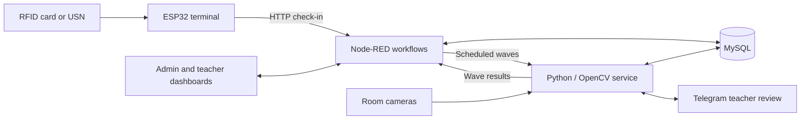
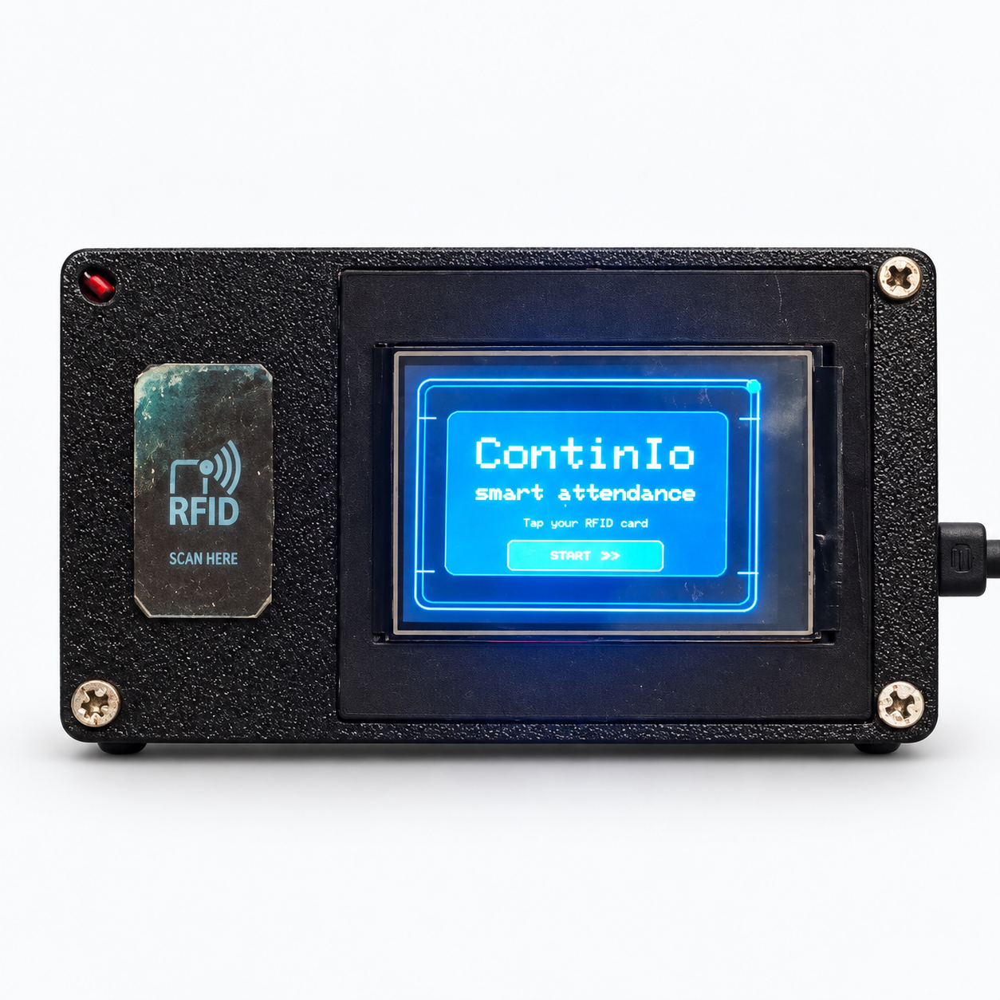

# ContinIo — Smart Attendance Management System

An IoT classroom-attendance prototype combining **ESP32 RFID check-in, touchscreen entry, camera-based verification, and teacher review**. ContinIo connects a physical door terminal to web dashboards and Telegram so attendance can be checked, reviewed, and submitted from one workflow.

**Stack:** ESP32 · C++/Arduino · Node-RED · FlowFuse Dashboard · Python/Flask · OpenCV · MySQL · Telegram Bot API

## What it does

- **RFID and manual check-in:** students tap a card or enter their USN on the touchscreen.
- **Admin dashboard:** manage students, teachers, RFID assignments, face enrollment, rooms, subjects, and timetables.
- **Scheduled verification:** three camera waves run during each active class.
- **Two camera feeds:** local webcams or network streams for Rooms 101 and 102, with reconnecting capture workers.
- **Teacher portal:** review automated outcomes, record decisions, and submit attendance.
- **Telegram integration:** link teachers to the bot, receive review notifications, resolve flagged attendance, and confirm submission.
- **Attendance exports:** inspect session details and export attendance as CSV.
- **In-memory image processing:** enrollment photos and camera frames are processed in RAM; normalized face embeddings and attendance records are stored in MySQL.

## How it works



1. A valid check-in associates a student with an active class session.
2. Verification waves run at approximately 25%, 50%, and 75% of the scheduled period.
3. Each wave first counts visible faces. If the count is at least the number of checked-in students, the implementation clears that wave without individual identity matching. Otherwise, it compares face embeddings for checked-in students.
4. The automated outcome is presented for teacher review and final submission.

| Successful waves | Automated outcome |
| --- | --- |
| 3 of 3 | Present |
| 2 of 3 | Teacher review |
| 0 or 1 of 3 | Absent |
| Technically incomplete cycle | Teacher review |

The count shortcut is a demonstration tradeoff: a sufficient headcount does **not** establish that each checked-in student is present. This is a prototype, not a guarantee against proxy attendance.

## Project ContinIo/media/

Five project photos and the dashboard walkthrough are included below. See [the ContinIo/media/ guide](docsContinIoContinIoContinIoContinIo/ContinIo/media/////.md) to replace them.

### Hardware and check-in workflow


| RFID check-in | Manual touchscreen entry |
| --- | --- |
|  |  |

| Successful check-in | Access denied |
| --- | --- |
|  |  |

[Watch the dashboard walkthrough](ContinIo/media//videos/Continio%20Dashboard.mp4)

## Repository layout

```text
firmware/ContinIo_Final_ESP32_API/  ESP32 sketch and local-config template
node-red/                         Dashboard/API flow and environment template
database/migrations/              Supplied database upgrade scripts
continio_face_service.py          Face enrollment, camera waves and Telegram
continio_face_requirements.txt    Python dependencies
download_face_models.py           OpenCV model downloader
Setup_ContinIo_Telegram.command   macOS configuration helper
Start_ContinIo_Telegram.command   macOS demo launcher
docs/                            Setup, architecture, hardware and ContinIo/media/ guide
ContinIo/media//images/                    Add the five project photos here
ContinIo/media//videos/                    Add project recordings here
scripts/                         Offline source checks
```

## Setup

Read the [setup guide](docs/SETUP.md) and [hardware pin map](docs/HARDWARE.md).

**Database prerequisite:** the supplied archive includes migrations, but not the original base database schema. The migrations do not create a fresh working installation. Restore a compatible existing `continio` database, or provide its schema-only export as described in [database/README.md](database/README.md).

The exported Node-RED flow requires [FlowFuse Dashboard](https://dashboard.flowfuse.com/getting-started) and [node-red-node-mysql](https://flows.nodered.org/node/node-red-node-mysql). The Python requirements and firmware include list identify the other dependencies.

## Scope and limitations

This repository preserves an academic/demo implementation. Local secrets are excluded and configuration examples are provided. It has not been validated as a production deployment. Read [security and data-handling notes](SECURITY.md) before running it beyond a trusted development network.

The Python virtual environment, downloaded models, duplicate flow export, local credentials and raw recordings from the original bundle are intentionally not included. Model files can be downloaded using the supplied helper; their upstream terms remain applicable.

## Checks

From the repository root:

```sh
python3 scripts/check_source.py
node scripts/check_flows.js
zsh -n Setup_ContinIo_Telegram.command
zsh -n Start_ContinIo_Telegram.command
```

These are offline syntax/configuration checks. They do not replace running the system with MySQL, the original schema, an ESP32 and cameras. The [setup guide](docs/SETUP.md#end-to-end-check) includes a manual integration sequence.
